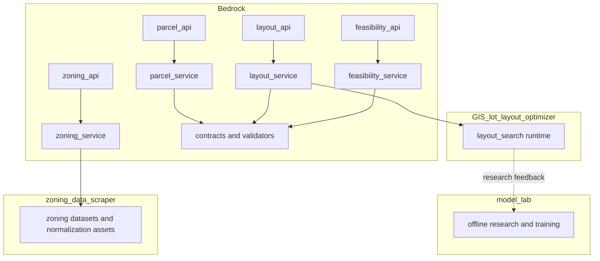

# Current Runtime Architecture

## Purpose

This document describes the implemented runtime as it exists today, not the fully normalized target architecture.

## Runtime Summary

Today the platform is mixed-mode:

- Bedrock exposes public milestone APIs
- Bedrock also contains orchestration and compatibility logic
- `GIS_lot_layout_optimizer` supplies the active layout runtime
- `GIS_lot_layout_optimizer/model_lab` remains an offline research surface
- `zoning_data_scraper` supplies active zoning datasets and normalization support

## Runtime Component Map

## What is active

- `bedrock/api/parcel_api.py`
- `bedrock/api/zoning_api.py`
- `bedrock/api/layout_api.py`
- `bedrock/api/feasibility_api.py`
- `bedrock/services/parcel_service.py`
- `bedrock/services/zoning_service.py`
- `bedrock/services/layout_service.py`
- `bedrock/services/feasibility_service.py`
- `bedrock/pipelines/parcel_feasibility_pipeline.py`
- `bedrock/contracts/*`

## Public API normalization level

Current Bedrock APIs are active platform boundaries. Feasibility remains wrapped in a response envelope; the other primary stage APIs emit canonical stage contracts.

## Parcel runtime state

- implemented directly in Bedrock
- normalizes geometry and computes parcel metrics
- persists parcels in SQLite using `ParcelStore`
- derives jurisdiction from local boundary geometries when omitted

## Zoning runtime state

- implemented in Bedrock with `zoning_data_scraper` dataset support
- resolves jurisdiction and district from overlay-backed zoning datasets
- normalizes zoning rules into canonical `ZoningRules`
- carries overlay labels into the canonical zoning payload

## Layout runtime state

- Bedrock public API is implemented
- actual layout generation is delegated to the GIS runtime in `GIS_lot_layout_optimizer`
- `model_lab` remains offline research support, not an active production dependency
- canonical `LayoutResult` remains the runtime contract surface

## Feasibility runtime state

- implemented directly in Bedrock
- supports one-layout evaluation and multi-layout ranking
- computes deterministic financial outputs and explanation data
- returns wrapper response `FeasibilityEvaluationResponse`
- wrapped result objects are canonical `FeasibilityResult`

## Current runtime failure and compatibility model

Compatibility layers in use:

- feasibility response wrapper

## Current state vs target state

### Current state

- public APIs exist
- parcel, zoning, and layout align to canonical stage contracts
- feasibility exposes canonical results through a wrapper

### Target state

- public boundaries emit the governance-approved canonical contracts directly
- zoning emits parcel-scoped `ZoningRules`
- layout emits canonical `LayoutResult`
- feasibility response envelope, if retained, is explicitly governed as part of the service contract

`takeoff_archive` is frozen legacy research code and is not part of the active Land Feasibility Platform.
