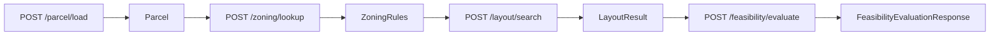
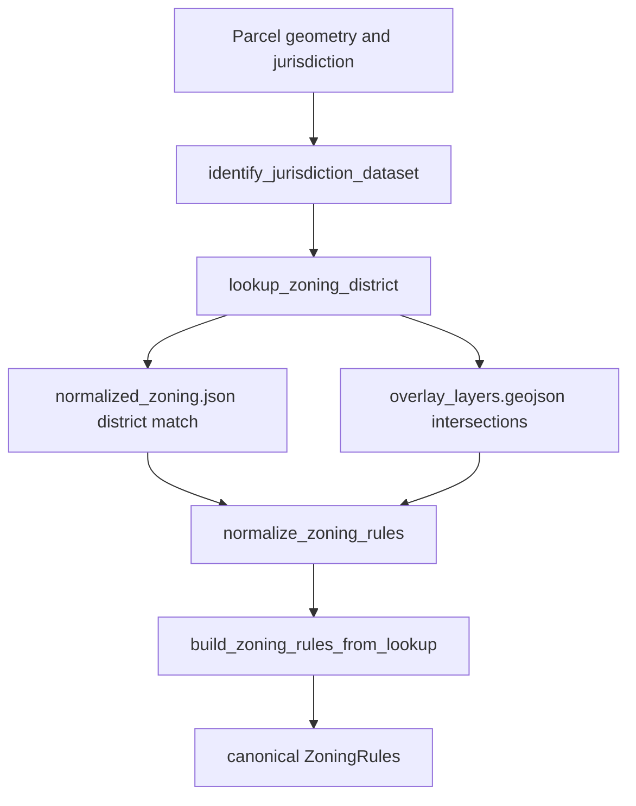

# Feasibility Pipeline Overview

## Purpose

This document is the authoritative overview of the Land Feasibility Platform pipeline for Milestone 2 zoning service documentation.

It distinguishes:

- the canonical target pipeline
- the current implemented pipeline
- transitional compatibility and normalization layers

## Canonical Target Pipeline

Governance-approved contract chain:

`Parcel -> ZoningRules -> LayoutResult -> FeasibilityResult`

These contracts are defined in `bedrock/contracts/*` and registered in `bedrock/contracts/schema_registry.py`.

## Current Implemented Pipeline

Implemented public Bedrock APIs:

- `POST /parcel/load`
- `POST /zoning/lookup`
- `POST /layout/search`
- `POST /feasibility/evaluate`

## Zoning Stage Architecture

## Stage Responsibilities

### 1. Parcel

Runtime path:

- `bedrock.api.parcel_api`
- `bedrock.services.parcel_service`

Behavior:

- normalizes inbound geometry
- computes centroid, bounds, and `area_sqft`
- resolves jurisdiction if omitted
- persists parcel to local SQLite
- emits canonical `Parcel`

### 2. Zoning

Runtime path:

- `bedrock.api.zoning_api`
- `bedrock.services.zoning_service`
- `zoning_data_scraper.services.zoning_overlay`
- `zoning_data_scraper.services.rule_normalization`

Behavior:

- selects the best jurisdiction dataset by parcel geometry intersection
- resolves the top zoning district by parcel geometry overlap
- resolves all intersecting overlay labels from `overlay_layers.geojson` when that file exists
- normalizes district rule payloads into Bedrock-friendly scalar fields
- emits canonical `ZoningRules`

Overlay implementation:

- overlay matches are accumulated from `overlay_layers.geojson`
- overlay labels are deduplicated while preserving encounter order
- the resulting overlay names are carried into canonical `ZoningRules.overlays`

Supported jurisdiction coverage for this milestone:

- Salt Lake City
- Lehi
- Draper

### 3. Layout

Runtime path:

- `bedrock.api.layout_api`
- `bedrock.services.layout_service`
- GIS engine in `GIS_lot_layout_optimizer`

Behavior:

- accepts canonical `Parcel` and canonical `ZoningRules`
- uses normalized zoning fields and standards-derived fallbacks
- invokes the GIS layout search engine
- emits canonical `LayoutResult`

### 4. Feasibility

Runtime path:

- `bedrock.api.feasibility_api`
- `bedrock.services.feasibility_service`

Behavior:

- evaluates one layout or ranks many
- computes deterministic revenue, cost, profit, ROI, and risk
- returns `FeasibilityEvaluationResponse`
- wrapper contains canonical `FeasibilityResult` plus optional `ScenarioEvaluation`

## Normalization Layers

### Rule normalization

`zoning_data_scraper.services.rule_normalization.normalize_zoning_rules(...)` currently:

- locates district rules from `district_rules.json`, `zoning_rules.json`, `rules.json`, or `development_standards.json`
- normalizes key names across district code and district name variants
- coerces numeric fields from strings where possible
- normalizes setbacks from nested or flat input fields
- normalizes lot coverage into a fraction when percentage values are supplied
- carries overlay matches forward from spatial overlay resolution

### Contract normalization

`bedrock.contracts.validators.build_zoning_rules_from_lookup(...)` then:

- binds the zoning payload to `parcel_id`
- maps normalized scalar fields into canonical `ZoningRules`
- converts `height_limit` to `height_limit_ft`
- converts `lot_coverage_limit` to `lot_coverage_max`
- validates the final parcel-scoped zoning contract

## Current State vs Target Architecture

### Current state

- Milestone 2 zoning lookup is implemented.
- Public `POST /zoning/lookup` now emits canonical `ZoningRules`.
- Overlay matching is implemented through `overlay_layers.geojson` when present.
- Jurisdiction selection and district selection are geometry-driven, not district-code-only.
- Minimum milestone jurisdiction coverage includes Salt Lake City, Lehi, and Draper.

### Target state

- zoning datasets expand beyond milestone coverage
- more standards populate `standards`, `allowed_uses`, and `citations`
- overlay and district sources converge under a single governed ingestion and publishing workflow
