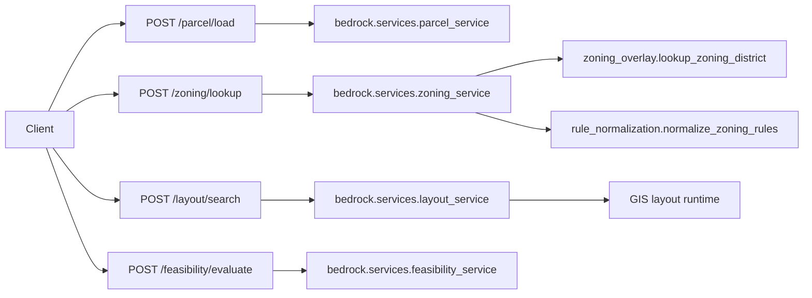

# Service Interfaces

## Purpose

This document reconciles the governance-approved canonical contracts with the public APIs that are implemented for Milestone 2.

It specifically documents:

- zoning overlay implementation
- zoning rule normalization behavior
- supported jurisdiction coverage

## Canonical Target Pipeline

Governance-approved contract chain:

`Parcel -> ZoningRules -> LayoutResult -> FeasibilityResult`

## Current Implemented Public APIs

Implemented Bedrock APIs:

- `POST /parcel/load`
- `POST /zoning/lookup`
- `POST /layout/search`
- `POST /feasibility/evaluate`

Important current-state note:

- the first three stage APIs now emit canonical contract models directly
- the feasibility API still returns a response wrapper containing canonical results

## Interface Topology



## 1. `POST /zoning/lookup`

Defined in `bedrock/api/zoning_api.py`.

### Request

```json
{
  "parcel": { "...canonical Parcel..." }
}
```

### Response

- response model: canonical `ZoningRules`

### Implemented behavior

`bedrock.services.zoning_service.ZoningService.lookup(...)`:

1. resolves the best jurisdiction dataset from parcel geometry and optional jurisdiction hint
2. resolves the best zoning district by parcel geometry overlap
3. resolves intersecting overlay labels when overlay geometry exists
4. normalizes rule fields into Bedrock’s canonical zoning shape
5. binds the normalized rules to the input parcel and returns canonical `ZoningRules`

### Zoning overlay implementation

Overlay behavior is implemented in `zoning_data_scraper.services.zoning_overlay`:

- district geometry comes from `normalized_zoning.json`
- overlay geometry comes from `overlay_layers.geojson`
- overlays are matched by parcel geometry intersection
- overlay labels are deduplicated while preserving order
- resulting labels are emitted through `ZoningRules.overlays`

### Rule normalization behavior

Rule normalization is implemented in `zoning_data_scraper.services.rule_normalization.normalize_zoning_rules(...)` and finalized in `bedrock.contracts.validators.build_zoning_rules_from_lookup(...)`.

Normalization currently:

- matches district rules using normalized district code or district name
- loads rules from `district_rules.json`, `zoning_rules.json`, `rules.json`, or `development_standards.json`
- coerces numeric fields from string input
- normalizes setbacks from flat or nested fields
- normalizes lot coverage percentages into fractions
- carries overlays into the canonical contract
- maps milestone field names into canonical Bedrock field names

### Supported jurisdictions

Minimum milestone coverage is implemented for:

- Salt Lake City
- Lehi
- Draper

These jurisdictions are represented in the zoning datasets consumed by the overlay lookup layer.

## 2. `POST /layout/search`

Defined in `bedrock/api/layout_api.py`.

### Request

- `parcel: Parcel`
- `zoning: ZoningRules`
- `max_candidates`

### Response

- response model: canonical `LayoutResult`

### Implemented behavior

`bedrock.services.layout_service.search_layout(...)`:

- reads canonical zoning fields directly
- falls back to `standards` when scalar zoning fields are absent
- derives frontage and depth from normalized setbacks and lot size
- delegates candidate generation to the GIS layout runtime
- returns canonical `LayoutResult`

### LayoutResult alias rules

Canonical alias behavior from `bedrock/contracts/layout_result.py`:

- `unit_count` accepts `units` and `lot_count`
- `road_length_ft` accepts `road_length`
- `road_geometries` accepts `street_network`
- `open_space_area_sqft` accepts `open_space_area`
- `utility_length_ft` accepts `utility_length`

Compatibility shim:

- `build_layout_result(...)` still exists to normalize legacy layout outputs and enforce `parcel_id`

## 3. `POST /feasibility/evaluate`

Defined in `bedrock/api/feasibility_api.py`.

### Request

- `parcel: Parcel`
- either `layout` or `layouts`
- `market_context: MarketData`

### Response

- response model: `FeasibilityEvaluationResponse`

Current state:

- response wrapper contains canonical `FeasibilityResult`
- multi-layout requests also include `ScenarioEvaluation`

## Current State vs Target Interface Model

| Interface | Current public API | Canonical target |
| --- | --- | --- |
| Parcel | `Parcel` | `Parcel` |
| Zoning | `ZoningRules` | `ZoningRules` |
| Layout | `LayoutResult` | `LayoutResult` |
| Feasibility | `FeasibilityEvaluationResponse` containing `FeasibilityResult` | `FeasibilityResult` remains the canonical stage result |

## Remaining interface discrepancy

- the feasibility API still uses a wrapper response rather than returning a bare `FeasibilityResult`
