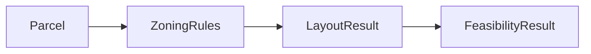

# Feasibility Pipeline Data Contracts

## Purpose

This document is the authoritative contract reference for Bedrock pipeline data exchange.

Canonical contracts:

- `Parcel`
- `ZoningRules`
- `LayoutResult`
- `FeasibilityResult`

Contract authority:

- model definitions in `bedrock/contracts/*.py`
- registry and service rules in `bedrock/contracts/schema_registry.py`
- validation helpers in `bedrock/contracts/validators.py`
- governance decision records in `docs/contracts/*_governance_decision.md`

## Contract Lineage



Cross-stage invariants enforced by `validate_feasibility_pipeline_contracts(...)`:

- `ZoningRules.parcel_id == Parcel.parcel_id`
- `LayoutResult.parcel_id == Parcel.parcel_id`
- `FeasibilityResult.parcel_id`, when present, matches `Parcel.parcel_id`
- `FeasibilityResult.layout_id == LayoutResult.layout_id`

## 1. Parcel

Defined in `bedrock/contracts/parcel.py`.

### Canonical shape

- `schema_name = "Parcel"`
- `schema_version = "1.0.0"`
- `parcel_id`
- `geometry`
- `jurisdiction`
- `area_sqft`
- optional metadata and parcel context fields

### Field meaning

- `parcel_id`: stable parcel identifier used across all stages
- `geometry`: normalized GeoJSON boundary polygon for the parcel
- `jurisdiction`: city/county context used for zoning dataset selection
- `area_sqft`: canonical parcel area in square feet
- `centroid`: representative point used for spatial lookups and logging
- `bounding_box`: min/max bounds used for storage index and fast spatial filtering

### Example object

```json
{
  "schema_name": "Parcel",
  "schema_version": "1.0.0",
  "parcel_id": "parcel-001",
  "geometry": {
    "type": "Polygon",
    "coordinates": [[[-111.9, 40.7], [-111.899, 40.7], [-111.899, 40.701], [-111.9, 40.701], [-111.9, 40.7]]]
  },
  "jurisdiction": "Salt Lake City",
  "area_sqft": 5234.2,
  "centroid": [-111.8995, 40.7005],
  "bounding_box": [-111.9, 40.7, -111.899, 40.701]
}
```

### Compatibility rules

- `area` is accepted as an input alias and canonicalized to `area_sqft`
- property alias `Parcel.area` remains available

### Normalization and storage behavior

Normalization is performed by `bedrock/services/parcel_service.py`:

- input `geometry` is normalized to GeoJSON `Polygon` or `MultiPolygon`
- `centroid` and `bounding_box` are derived from normalized geometry
- `area_sqft` is computed from geometry and persisted as the canonical area field
- `jurisdiction` is resolved from location if omitted, with `"unknown"` fallback

Storage is handled by `bedrock/services/parcel_store.py`:

- parcels are written to SQLite table `parcels`
- geometry is stored as `geometry_json`
- bbox columns are indexed through `parcels_rtree` for spatial lookup support
- duplicate `parcel_id` values are rejected

## 2. ZoningRules

Defined in `bedrock/contracts/zoning_rules.py`.

### Canonical shape

- `schema_name = "ZoningRules"`
- `schema_version = "1.0.0"`
- `parcel_id`
- `jurisdiction`
- `district`
- `district_id`
- `description`
- `overlays`
- `standards`
- `setbacks`
- `min_lot_size_sqft`
- `max_units_per_acre`
- `height_limit_ft`
- `lot_coverage_max`
- `min_frontage_ft`
- `road_right_of_way_ft`
- `allowed_uses`
- `citations`
- `metadata`

### Field meaning

- `parcel_id`: parcel identifier this zoning payload applies to
- `district`: normalized zoning district code/name used by layout
- `setbacks.front|side|rear`: minimum setback distances in feet
- `min_lot_size_sqft`: minimum legal lot area per lot
- `max_units_per_acre`: parcel density cap used to bound unit yield
- `overlays`: additional overlay designations that can modify standards
- `standards`: normalized development standards list with citations

### Example object

```json
{
  "schema_name": "ZoningRules",
  "schema_version": "1.0.0",
  "parcel_id": "parcel-001",
  "jurisdiction": "Salt Lake City",
  "district": "R-1-7000",
  "overlays": ["Hillside Overlay"],
  "setbacks": { "front": 20.0, "side": 8.0, "rear": 25.0 },
  "min_lot_size_sqft": 7000.0,
  "max_units_per_acre": 6.0,
  "allowed_uses": ["single_family_residential"],
  "citations": ["SLC 21A.24"]
}
```

### Overlay implementation

Current overlay behavior comes from `zoning_data_scraper.services.zoning_overlay.lookup_zoning_district(...)`:

- zoning district is resolved from `normalized_zoning.json`
- overlay labels are resolved from `overlay_layers.geojson` when available
- overlay labels are deduplicated and stored in `ZoningRules.overlays`

This means overlays are now part of the implemented canonical zoning payload, not just a future extension.

### Rule normalization behavior

Current rule normalization comes from `zoning_data_scraper.services.rule_normalization.normalize_zoning_rules(...)` and `bedrock.contracts.validators.build_zoning_rules_from_lookup(...)`.

Normalization behavior includes:

- matching district rules by normalized district code or district name
- coercing numeric values from strings
- deriving scalar fields from rule records
- normalizing setbacks from flat or nested input fields
- converting lot coverage percentages into `[0, 1]` fractions where needed
- carrying overlays forward from the overlay lookup layer
- mapping `height_limit` to canonical `height_limit_ft`
- mapping `lot_coverage_limit` to canonical `lot_coverage_max`
- binding the output to the calling parcel via `parcel_id`

### Expected semantics of normalized zoning fields

- `district`: canonical zoning district code/name selected by spatial match
- `min_lot_size_sqft`: minimum legal lot area for subdivision generation
- `max_units_per_acre`: density cap used to bound layout unit count
- `setbacks.front`: minimum front yard setback in feet
- `setbacks.side`: minimum side yard setback in feet
- `setbacks.rear`: minimum rear yard setback in feet

These fields are treated as layout-critical and must be present for zoning-complete layout generation.

### Zoning-to-layout guarantees

Before crossing into layout, zoning is validated for layout-safe execution:

- `min_lot_size_sqft` must be present and `> 0`
- `max_units_per_acre` must be present and `> 0`
- `setbacks.front`, `setbacks.side`, and `setbacks.rear` must be present and `> 0`
- `district` is canonicalized to deterministic form

Resolution is deterministic: raw lookup -> canonicalization -> sanitization -> fallback enrichment -> normalization -> validation.

Failure behavior is fail-closed:

- missing required fields: `IncompleteZoningRulesError`
- invalid but present fields: `InvalidZoningRulesError`

### Supported jurisdictions

Minimum milestone coverage is implemented for:

- Salt Lake City
- Lehi
- Draper

These jurisdictions are present both in the Bedrock-side geometry/jurisdiction logic and in the zoning dataset discovery inputs used by the overlay service.

### Compatibility rules

- `district` accepts aliases `district`, `code`, and `zoning_district`
- `overlay` is accepted and normalized into `overlays`
- scalar convenience fields may be backfilled from `standards`
- synthetic standards are created for canonical scalar fields when those scalar values exist

## 3. LayoutResult

Defined in `bedrock/contracts/layout_result.py`.

### Canonical shape

- `schema_name = "LayoutResult"`
- `schema_version = "1.0.0"`
- `layout_id`
- `parcel_id`
- `unit_count`
- `road_length_ft`
- `lot_geometries`
- `road_geometries`
- `open_space_area_sqft`
- `utility_length_ft`
- optional `score`
- optional `buildable_area_sqft`
- optional `metadata`

### Field meaning

- `layout_id`: unique identifier for the generated layout candidate
- `parcel_id`: parcel identifier this layout belongs to
- `unit_count`: total lots/units generated by the layout
- `lot_geometries`: GeoJSON lot polygons generated by the solver
- `road_geometries`: GeoJSON road network geometries
- `road_length_ft`: total road length used for cost and feasibility
- `score`: layout quality score used for candidate ranking

### Example object

```json
{
  "schema_name": "LayoutResult",
  "schema_version": "1.0.0",
  "layout_id": "layout-parcel-001-abc123",
  "parcel_id": "parcel-001",
  "unit_count": 8,
  "road_length_ft": 420.5,
  "lot_geometries": [],
  "road_geometries": [],
  "open_space_area_sqft": 0.0,
  "utility_length_ft": 0.0,
  "score": 0.87
}
```

### LayoutResult alias rules

- `unit_count` accepts `unit_count`, `units`, `lot_count`
- `road_length_ft` accepts `road_length_ft`, `road_length`
- `road_geometries` accepts `road_geometries`, `street_network`
- `open_space_area_sqft` accepts `open_space_area_sqft`, `open_space_area`
- `utility_length_ft` accepts `utility_length_ft`, `utility_length`

Compatibility properties remain available:

- `lot_count`
- `units`
- `road_length`
- `street_network`
- `open_space_area`
- `utility_length`

### Adapter shim rules

`bedrock/contracts/validators.py::build_layout_result(...)` currently:

- injects `parcel_id` when omitted by upstream payloads
- normalizes legacy metadata shapes into canonical `EngineMetadata`
- validates the final canonical layout payload

## 4. FeasibilityResult

Defined in `bedrock/contracts/feasibility_result.py`.

### Canonical shape

- `scenario_id`
- `layout_id`
- optional `parcel_id`
- `units`
- financial projection fields
- `risk_score`
- `constraint_violations`
- `confidence`
- `status`
- `financial_summary`
- optional `explanation`

### Field meaning

- `scenario_id`: deterministic identifier for the evaluated scenario
- `layout_id`: layout candidate that was evaluated
- `units`: feasible unit count used in economic projections
- `projected_revenue|projected_cost|projected_profit`: core financial outputs
- `ROI`: return on investment metric
- `risk_score`: normalized risk estimate in `[0,1]`
- `constraint_violations`: constraint or economic warning flags
- `status`: high-level feasibility status (for example `feasible` or `constrained`)

### Example object

```json
{
  "schema_name": "FeasibilityResult",
  "schema_version": "1.0.0",
  "scenario_id": "scenario-123",
  "layout_id": "layout-parcel-001-abc123",
  "parcel_id": "parcel-001",
  "units": 8,
  "projected_revenue": 4160000.0,
  "projected_cost": 2450000.0,
  "projected_profit": 1710000.0,
  "ROI": 0.698,
  "risk_score": 0.22,
  "constraint_violations": [],
  "confidence": 0.9,
  "status": "feasible"
}
```

### Compatibility rules

- canonical capacity field is `units`
- `units` accepts aliases `units`, `feasible_units`, and `max_units`
- financial aliases such as `roi`, `revenue`, `total_cost`, and `profit` remain accepted

## Known implementation notes

- public `POST /zoning/lookup` now returns canonical `ZoningRules`
- public `POST /layout/search` returns canonical `LayoutResult`
- public `POST /feasibility/evaluate` returns canonical `FeasibilityResult`
- public `POST /pipeline/run` accepts `parcel_geometry` and returns canonical `FeasibilityResult`

## Required fields and constraints

### Parcel

- required: `parcel_id:str`, `geometry:GeoJSON Polygon|MultiPolygon`, `jurisdiction:str`, `area_sqft:float`
- constraints:
- `area_sqft > 0`
- `slope_percent >= 0` when present
- `centroid` length must be `2` when present
- `bounding_box` length must be `4` when present
- no undocumented fields (`extra="forbid"`)

### ZoningRules

- required: `parcel_id:str`, `district:str`
- layout-required subset:
- `min_lot_size_sqft > 0`
- `max_units_per_acre > 0`
- `setbacks.front > 0`, `setbacks.side > 0`, `setbacks.rear > 0`
- range constraints:
- `lot_coverage_max` in `[0,1]` when present
- all setback and scalar numeric values must be non-negative when present
- no undocumented fields (`extra="forbid"`)

### LayoutResult

- required: `layout_id:str`, `parcel_id:str`, `unit_count:int`
- constraints:
- `unit_count >= 0`
- `road_length_ft >= 0`
- `open_space_area_sqft >= 0`
- `utility_length_ft >= 0`
- `buildable_area_sqft >= 0` when present
- `lot_geometries` and `road_geometries` entries must be GeoJSON geometry objects
- no undocumented fields (`extra="forbid"`)

### FeasibilityResult

- required: `scenario_id:str`, `layout_id:str`, `units:int`, `risk_score:float`, `confidence:float`
- financial required for validated service outputs:
- `projected_revenue`, `projected_cost`, `projected_profit`
- constraints:
- `units >= 0`
- `risk_score` in `[0,1]`
- `confidence` in `[0,1]`
- non-negative for costs and revenue fields
- no undocumented fields (`extra="forbid"`)

## Naming freeze

Canonical outbound names are frozen and must not drift:

- `Parcel.area_sqft` (not `area`, except input alias)
- `ZoningRules.min_lot_size_sqft` (not `minLotSize`, `lot_size_min`, `min_lot_sqft`)
- `ZoningRules.height_limit_ft` (legacy aliases are input-only)
- `ZoningRules.lot_coverage_max` (legacy aliases are input-only)
- `LayoutResult.unit_count` (legacy aliases are input-only)
- `FeasibilityResult.units` (legacy aliases are input-only)
